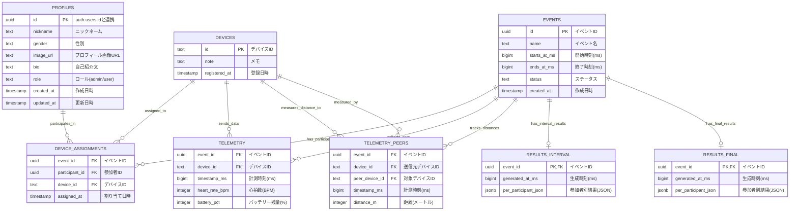

# Love Sports データベース ER図

## エンティティ関係図



## テーブル関係の詳細

### 1. 参加者・イベント・デバイスの関係
- **多対多関係**: 参加者とイベントは`device_assignments`テーブルで関連
- **多対多関係**: イベントとデバイスは`device_assignments`テーブルで関連
- **制約**: 1つのイベントで1人の参加者は1つのデバイスのみ使用可能

### 2. データ収集の流れ
```
イベント → デバイス割り当て → テレメトリデータ収集
    ↓
心拍数データ (telemetry)
距離データ (telemetry_peers)
    ↓
マッチング計算 → 結果生成
```

### 3. 結果データの構造
- **インターバル結果**: イベント中の中間結果
- **最終結果**: イベント終了後の確定結果
- **JSONB形式**: 柔軟な結果データ構造

## インデックス設計

### 主要インデックス
1. **テレメトリデータ**: `(event_id, device_id, timestamp_ms)`
2. **ピア距離データ**: 
   - `(event_id, device_id, timestamp_ms)`
   - `(event_id, peer_device_id, timestamp_ms)`

### 推奨追加インデックス
- `profiles.role`: ロール別検索
- `events.status`: ステータス別検索
- `events.starts_at_ms`: 日時範囲検索

## データフロー

### 1. イベント準備フェーズ
```
1. イベント作成 (events)
2. 参加者登録 (profiles)
3. デバイス登録 (devices)
4. 割り当て設定 (device_assignments)
```

### 2. データ収集フェーズ
```
1. 心拍数データ受信 (telemetry)
2. 距離データ受信 (telemetry_peers)
3. リアルタイム監視・分析
```

### 3. 結果生成フェーズ
```
1. インターバル結果生成 (results_interval)
2. 最終結果生成 (results_final)
3. 結果公開・表示
```

## パフォーマンス考慮事項

### 時系列データ最適化
- テレメトリデータは時系列で大量データ
- パーティショニング検討（イベント単位）
- TimescaleDB拡張の検討

### クエリ最適化
- 複合インデックスによる高速検索
- JSONBデータの効率的な検索
- バッチ処理による結果生成

## セキュリティ設計

### Row Level Security (RLS)
- **参加者**: 自分のデータのみアクセス可能
- **管理者**: 全データにアクセス可能
- **匿名ユーザー**: 公開結果のみアクセス可能

### データ保護
- UUID使用による予測困難なID
- 個人情報の適切な管理
- ログデータの暗号化検討
